# React Quiz

Конструктор тестів і кросвордів на будь-яку тему: питання з картинками, кілька правильних відповідей, автоматична генерація кросвордів, таймер і таблиця результатів.

**Демо:** https://react-qiuz-8f35e.web.app/

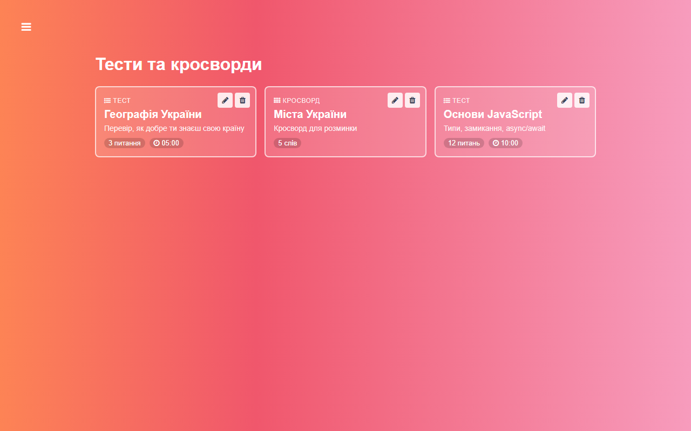

## Можливості

- **Тести** — питання з однією або кількома правильними відповідями, від 2 до 8 варіантів
- **Картинки в питаннях** — завантаження з комп'ютера (автоматично стискаються) або за посиланням
- **Кросворди** — вводиш слова й підказки, сітка генерується автоматично; проходження з клавіатури (стрілки, Backspace, клік по підказці)
- **Таймер** — необов'язковий ліміт часу на весь тест або кросворд; коли час вичерпано, спроба завершується автоматично
- **Перемішування** питань і варіантів відповіді
- **Розбір після завершення** — правильні відповіді, відсоток, оцінка, витрачений час
- **Результати** всіх учасників з фільтром за тестом і пошуком за ім'ям
- **Редагування й видалення** тестів (після авторизації)

## Скриншоти

| Питання з картинкою | Кілька правильних відповідей |
| --- | --- |
| 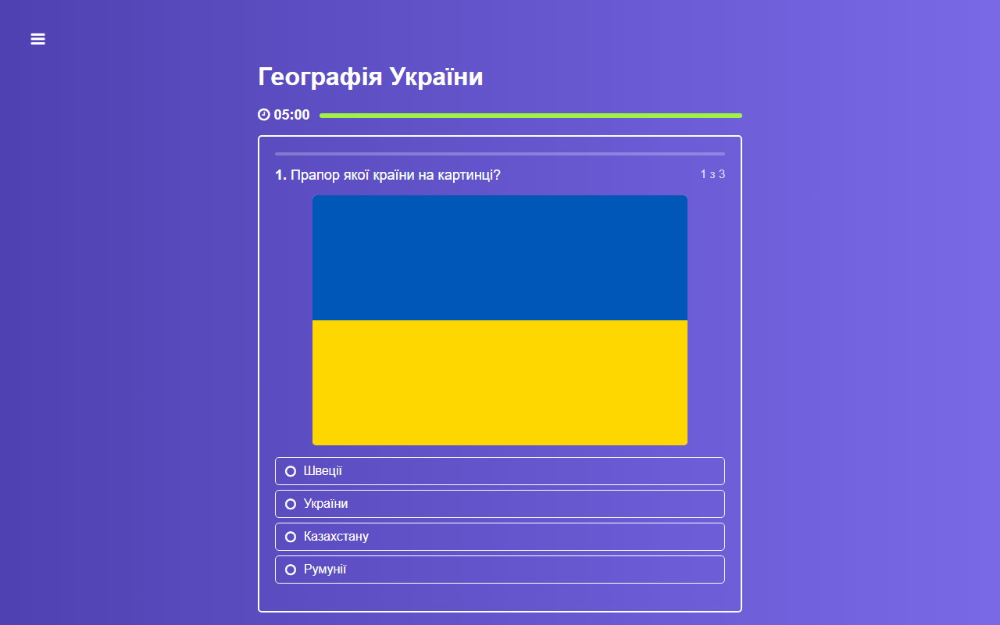 | 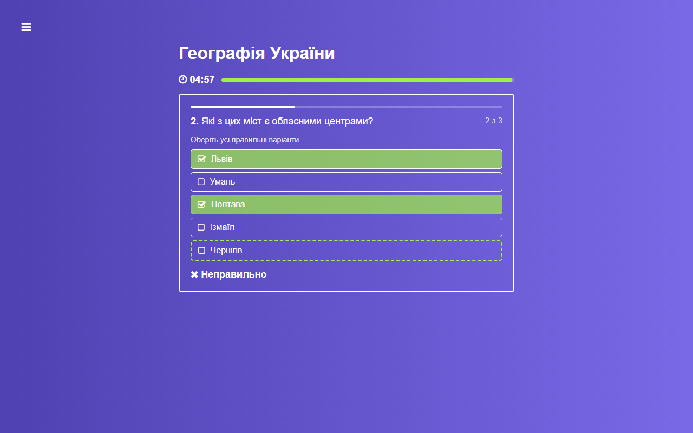 |

| Проходження кросворду | Перевірка кросворду |
| --- | --- |
| 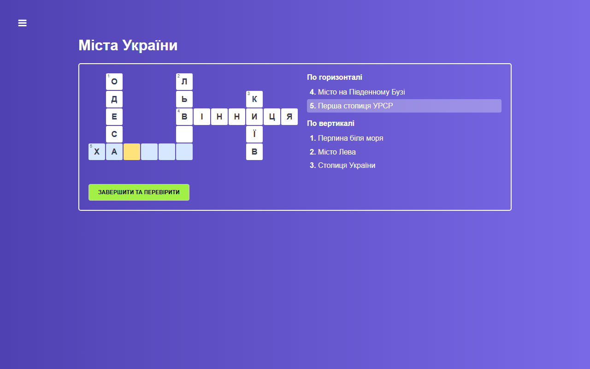 | 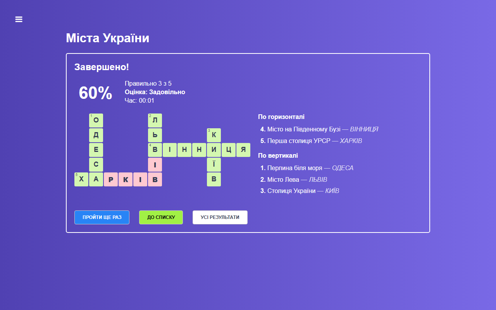 |

| Старт тесту | Результат тесту |
| --- | --- |
| 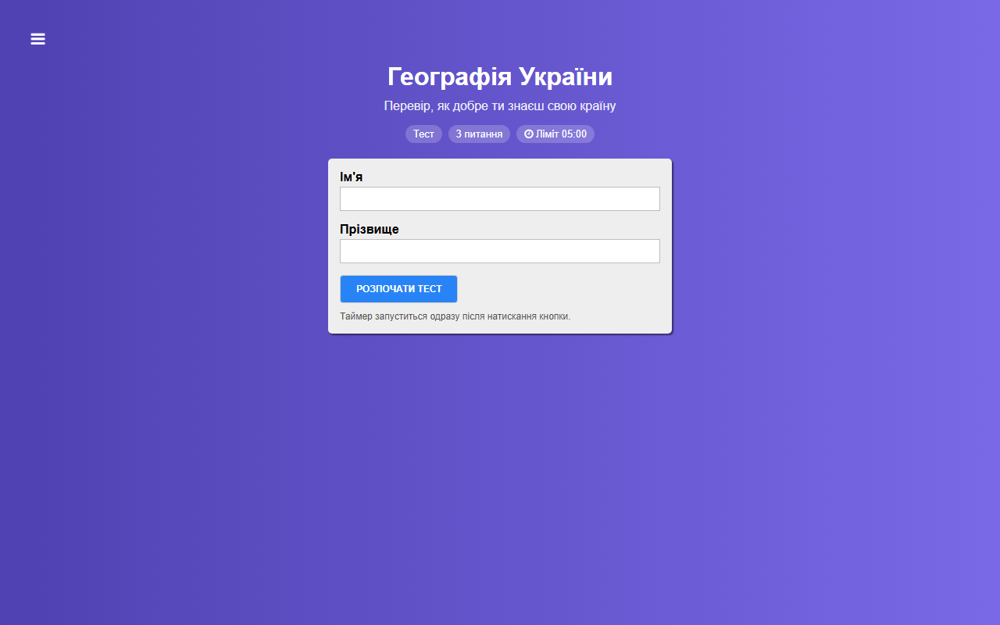 | 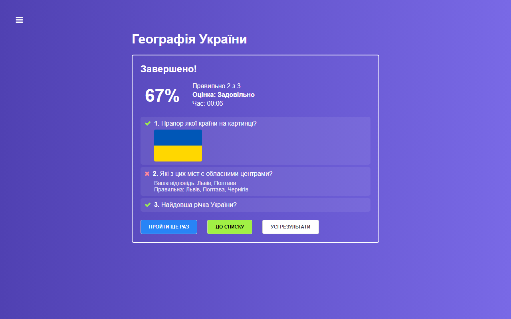 |

| Конструктор тесту | Конструктор кросворду |
| --- | --- |
| 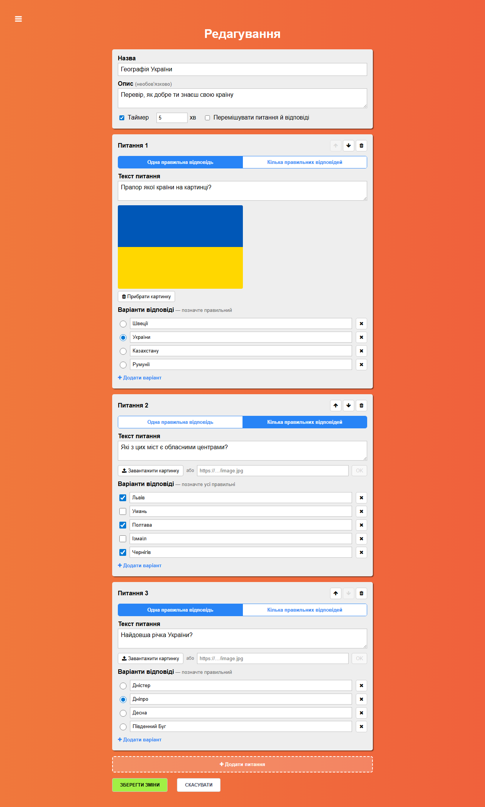 | 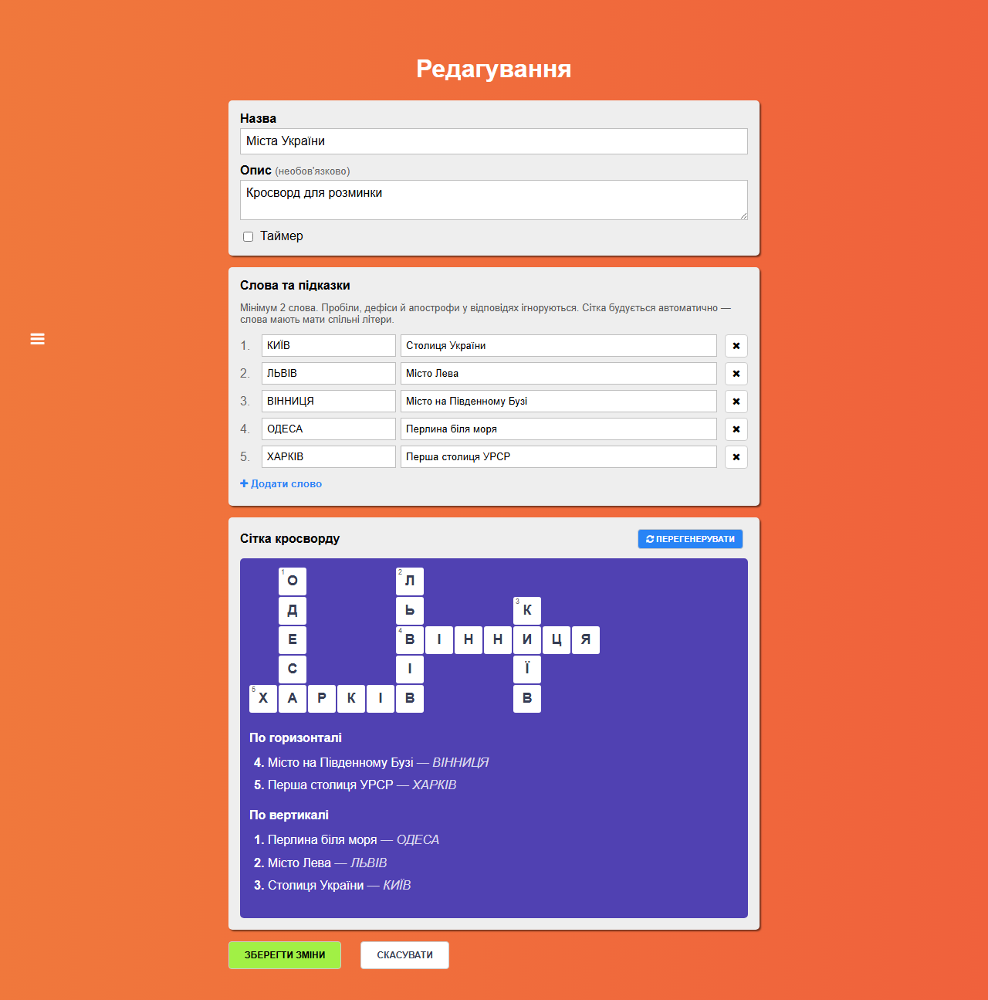 |

| Результати учасників | Про додаток |
| --- | --- |
| 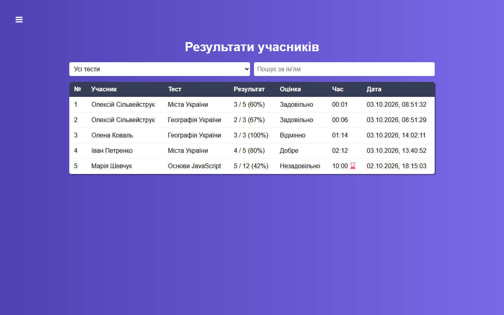 | 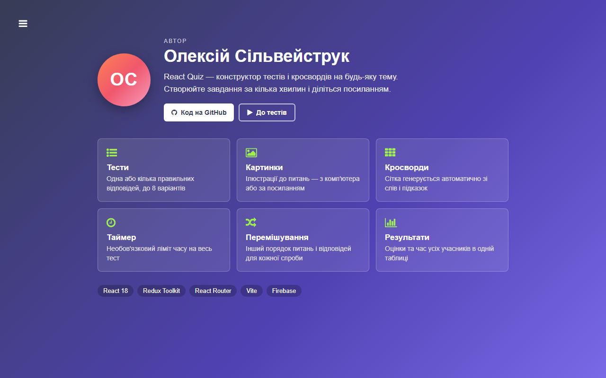 |

## Технології

React 18, Redux Toolkit, React Router 7, Vite, Firebase (Realtime Database, Auth, Hosting).

## Запуск

```bash
npm install
npm run dev      # локальний сервер розробки
npm run build    # production-збірка в dist/
firebase deploy --only hosting
```

## Автор

Олексій Сільвейструк
